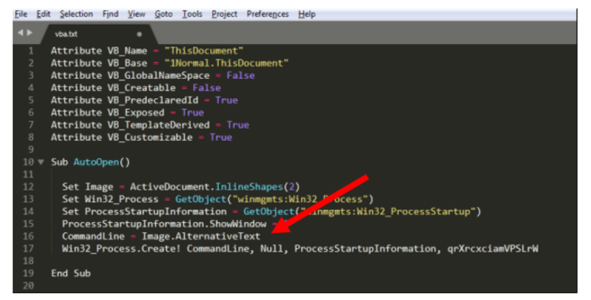
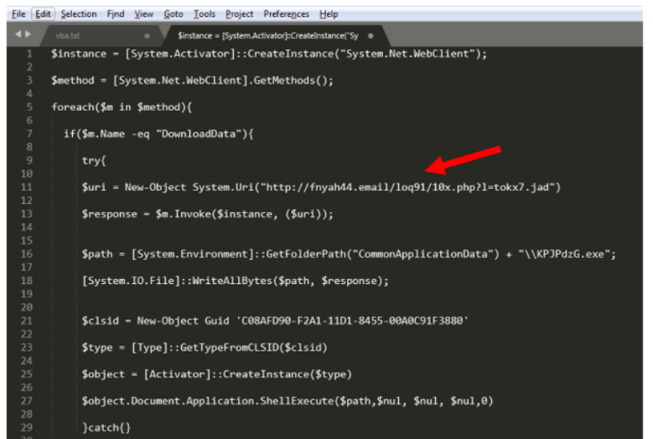
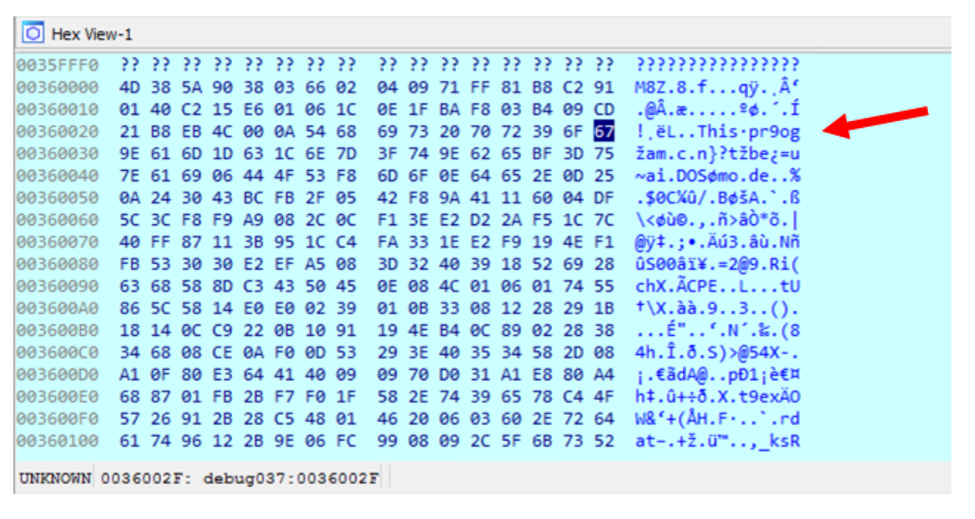
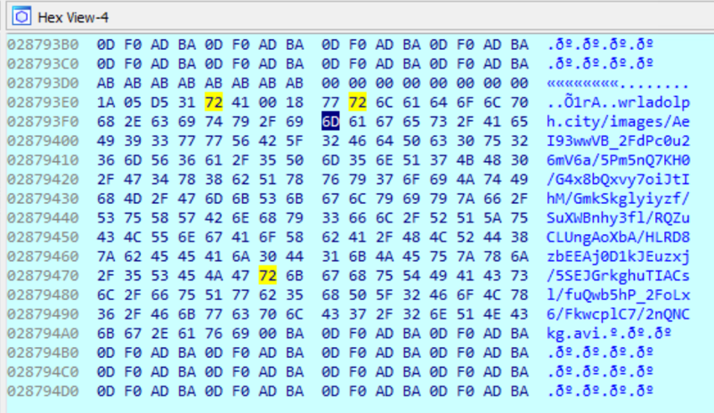
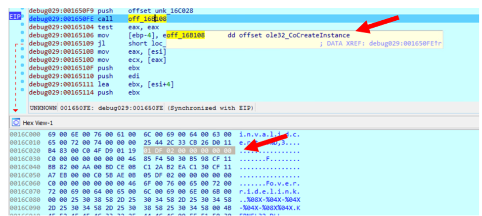

# Malware Analysis Journey a Relatively Quick Run-Down
## 1.0	Intro

This readme aims to inform others about the process of malware analysis while documenting my own journey into this area. It
serves to summarize the article (found under the files folder), which goes into greater detail but is rather long. If you are
unfamiliar with malware analysis or reverse engineering, the main article should be a better read. In this readme we will go 
through the four main parts of my malware analysis journey

- Word Macros
-	Unpacking malware
-	Discovering malware capabilities
-	Malware obfuscation techniques

### 1.1 Malware Background

Most malware write-ups focus on well-known malwares (e.g. Emotet or NotPetya), and this malware is no exception; except that I 
got it from my parents. My mom was emailed a word document from her boss’s hacked email account and after opening it figured 
something was wrong. Opening up the Word document in our VM, we are greeted with a page asking for macros to be enabled in order 
to view the content. Clicking enable content will run the macro and execute the malicious code on our system. This is because a 
macro is essentially a script that runs Visual Basic for Applications (VBA) code. By default, Word disables macros from untrusted
documents (i.e. downloaded from the internet), as there shouldn’t be downloaded documents automatically running code upon opening.
However, the technique has a high success rate as not many people know what a word macro is. To get an idea of what this macro 
does, we need to open it up. 

## 2.0 Word Macro

Opening up the macro in Sublime Text (a text editor), we can see the code is obfuscated. Formatting the macro by naming variables and moving code around produces this.

Looking at the code, we need to know what command line is being executed in order to figure out what the macro does. We can see that the command 
line is hidden in the alternative text of an image, which is the text that is displayed instead of an image if the image can’t 
load. We should be able to view this by printing out the alt-text when the macro runs.

### 2.1 Powershell

Reading the command line, it seems to execute a PowerShell command which is Base64 encoded. Decoding this command and formatting
it nicely we get the following.

Just looking at the code, we can see that it is trying to download data from a URL called fnyah44.email and is trying to store 
the data in C:\ProgramData\ and execute it. This confirms our suspicion that the word document was simply a dropper and the 
downloaded data is most likely our malware. If the malware domain was still up and running, I would have grabbed the malware 
from the folder and begun analyzing. However, by the time I had received the malware, the domain had expired and I was forced 
to use other methods. One of the ways we can download malware, besides visiting a malicious site, is to look for it on websites
that analyze and store malware data like VirusTotal. After searching for the URL on VirusTotal, I was able to find the executable that would have been downloaded and
retrieve it from VirusTotal's database.

## 3.0 Unpacking Malware
### 3.1 MoveDie.exe

When I first started static analysis, I spent a while looking through the default setups of getting environment variables and 
computers names. However, after these default functions calls I managed to find an interesting tidbit.

Above is a snippet from the decompiler in Ghidra. As shown, the malware checks for an environment variable called ‘casema’. Searching online, 
Casema seems to be a Dutch trading company and my first thought was that this was some sort of targeted malware where the 
malware authors only wanted it to execute on that specific company. However, one of my colleagues suggested that it was a kill 
switch instead, where if the environment variable was set to a certain value it wouldn’t run. Looking at the code it seems 
regardless of its value it continues execution. No clue what this does, but it made me curious as this was the only “malicious 
code” I could find in movedie.exe so I decided to change my approach from static to dynamic analysis. Stepping
through for a bit, I found a call to a module named welldrop.exe, which was essentially another program inside of movedie.exe. 
To enter welldrop.exe, the malware calls a register value (ESI) which points to a dynamic address inside of welldrop.exe and 
redirects the execution flow. 

### 3.2 WellDrop.exe

Looking through welldrop.exe, I originally thought it was the main bulk of malware. However, it turns out that most malware hide 
themselves in a type of program called a 
packer which helps obfuscate themselves so that anti-virus software have a harder time detecting them. A packer, by definition, needs some way of unpacking the malware hidden inside itself in order to execute it. This can be done 
in multiple ways, but I’m going to focus on my particular packer’s technique known as self-injection. In essence the packer will
unpack a “stub” into memory and then transfer execution to this stub. The stub then allocate the malware into a section of the
packer’s memory and changes the permissions of this area to execution and executes it.  One of the more common ways to do this
is to use Windows API calls such as VirtualAlloc and VirtualProtect. Since all Windows computers have these functions, the malware
can use VirtualAlloc to allocate a region of pages with certain permissions and then uses VirtualProtect to change those 
permissions. Sure enough, stepping through welldrop.exe we can see VirtualAlloc being called three times. Our first call 
allocates some memory (A) then redirect the execution flow into location A and allocates two more sections (B and C). Based on 
our knowledge above we can see that memory A is the stub and the malware should be in memory B or C. Viewing these sections, the beginning of memory C looks
like a weird MZ header.
  

  
It had an 8 in between the usual MZ and only parts of the DOS message. Some quick googling leads us to see that our malware is 
compressed with LZ-based compression and that there is a python tool that can help decompress it. After dumping the data from 
IDA-Pro and decompressing the malware we finally have our payload.

## 4.0 Discovering Malware Capabilities
### 4.1 Domain Names

Stepping through the program, I found the three C&C server names in memory as well as other URL’s. 

- wrladolph.city
- rsf58.city
- subaldodd.email

Looking these domains up online, we can see that they are well known command and control (C&C) servers. Unfortunately again, the command and control
servers were down when I reached this stage. Another URL that caught my eye was 
constitution.org as URL’s containing the .org extension are normally official sites. I was curious what malware could be using this 
for and a quick google brought me to an interesting article. It stated that older malware use to grab words from the US Declaration
of Independence and string them together to form random domains using a technique known as Domain Generation Algorithms (DGA). 
Through the use of DGA’s, malware is able to keep communicating with their C&C servers even if a C&C server goes down or is blocked.
However, while this was interesting, it seemed that our malware wasn’t actually using the DGA as the malware didn’t reference any of 
the code. 

### 4.2 Internet Explorer

Further along in the malware, we can see a couple of registry values: IE10 and IE8 (Internet Explorer versions) as well as the setup 
for a Check Association’s call. Check Association’s is a Windows call that checks if the user has permission to access a certain 
registry subkey or entry. I believe this call is used to check if the malware has permission to access Internet Explorer. 
If it can, then the malware builds a link to one of the three C&C server’s for Internet Explorer to send a request to. 

From memory, we can see with the link’s format, with first the domain followed by an images path and other random letters paths,
ending with a file extension of .avi. The file extension is a bit strange, .avi is a type of video file and on its own isn’t 
malicious. The answer would come later as I continued my investigation, so let’s move on. 

### 4.3 Reconnaissance

Continuing to step through the program, we see that the malware receives the HTTP response to its download request in memory. 

The response contains the default Internet Explorer response for no connection. The malware does not continue from beyond this point
and due to the obfuscation and dynamic nature of the malware, I was unable to find what the malware would do with a valid response.
Even changing the code to pass all of the branching statements was unhelpful as the program kept crashing after a certain point. 

Another way I attempted to find out the malware’s capabilities was by viewing its HTTP request in memory. If we find where
the malware stores those strings in memory, maybe we could see some of the strings the malware would use in other requests. Searching
around a bit, I found where the binary was retrieving those strings and copied them into notepad for formatting, as shown below. 

We can see some of the strings that were used to build our initial request as well as some additional strings. We can see some that 
can point to a post request and some sort of upload functionality (line 12, 15, 24). It also looks like the malware can add a 
.gif or .bmp extension as well as .avi (line 25). While we can’t determine the nature of these strings, we have gained some insight.

## 5.0 Finding the Malware Family
### 5.1 Ursnif Malware Family

While reading an article about the bad naming policies of anti-virus detection programs, it stated that anti-virus results were better
for unpacked malware. I decided to test this and uploaded my own version of the unpacked malware and saw that it was identified as
part of the Ursnif Malware family. Looking back at the past VirusTotal results for the original packed malware, there were some AV
programs that identified Ursnif, but many didn’t which created mixed results. However, in this case, it became clear that our
malware was part of Ursnif once I researched it. The style of infection, the formatting of the C&C URL’s, as well as the binaries 
behavior all matched. This was very good news as now I could check my work against professionals and see how much I found (or missed).

### 5.2 Brief Details about Ursnif

Ursnif is a banking Trojan which attempts to steal bank credentials and online account credentials. Reading through the articles,
it seems that there are many different strains of the malware and my version is not from the big strains. In general, after the malware’s initial
communication with the C&C server, the malware uses a range of attacks to steal cryptocurrency off the machine and steals login 
and server details from web browsers and email clients. It then performs a man-in-the-browser attack which essentially lets the 
malicious user gather all data accessed through the web browser like banking credentials and sends it back to the C&C server. 

### 5.3 Corrections

As I identified the malware family, I was able to read over other researchers analysis. While doing this I found that there were a couple things that I had either misunderstood the behavior of 
or wasn’t able to explain the reasoning for. One of the thing I couldn’t understand was why iexplorer.exe or our PowerShell 
command was not running as a child process under 2nd_formatted.exe. Our PowerShell command wasn't shown as, they used WMI functions
to call the process. This means that our process would run as the WMI executable, WmiPrvSE.exe which was shown.
Iexplorer.exe also didn’t show up as a child process because it was created as a COM object with a call to CoCreateInstance. 

COM stands Computer Object Model, which essentially is a binary model for programs to create environmentally neutral objects
that any program can use. A CLSID (class ID) is a GUID that references a COM object while a GUID is a number that identifies 
resources. When we run our COM object, it isn’t our malware that is running, but an environmentally neutral object that has the 
same properties as our malware. This is the reason iexplorer.exe doesn’t appear as a child process of our malware.
We can see that in the malware there is a call to CoCreateInstance and a CLSID passed is in, shown in the stack view underneath.
While the argument is in hex and little-endian format (basically stored in 8 byte size chunks in reverse order),
the value 0002DF01-0000-0000-C000-000000000046 is the CLSID of Internet Explorer. 
Internet Explorer is then created as a COM object which explains why it was spawned under svchost.exe.

Lastly, one of the things I misunderstood was the URL encoding. The URL’s created were not just random strings as I had 
thought but instead details about the environment being sent back to the malware server. While I had found the strings being encoded 
in the malware and questioned where they were being used, originally thinking as parameters in the request, I failed to relate it 
to the URL. I did however think the URL might be the encoded version of something but didn’t pursue it far enough.

It turns out, the malware sends the information above to the C&C server as part of the URL, encoded in Base64 with some characters
being replaced with their equivalent hex representation in order to fingerprint our computer. 

While I did miss these important areas of the malware, I am quite happy with the overall picture I managed to find. I understand
that my lack of experience lead to some of these mistakes, but am glad that there are other researchers who write about these topics
and are willing to educate others on them.   

## 6.0 Take Away

Overall, I am quite happy with the result of my experiment with malware analysis. We were able to successfully extract and understand
the macro VBA, download the packer, unpack the malware and understand its capabilities. Furthermore my first experience with “wild”
malware resulted in the analysis of a malware family that I haven’t heard of before and was quite interesting to learn about. 
I also learned a lot about the Windows API, unpacking malware and enjoyed the entire process of learning new things while being
uncomfortable with the material. Lastly, I hope you were able to take something away from this readme and thanks for reading.

